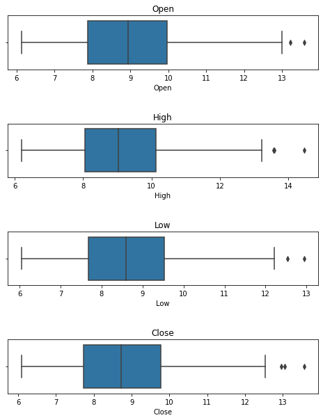
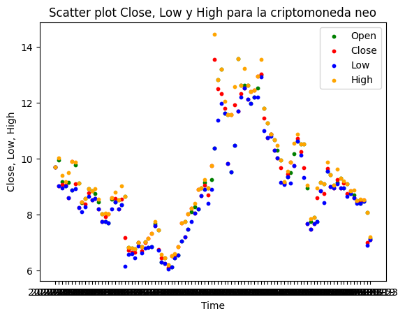
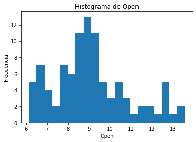
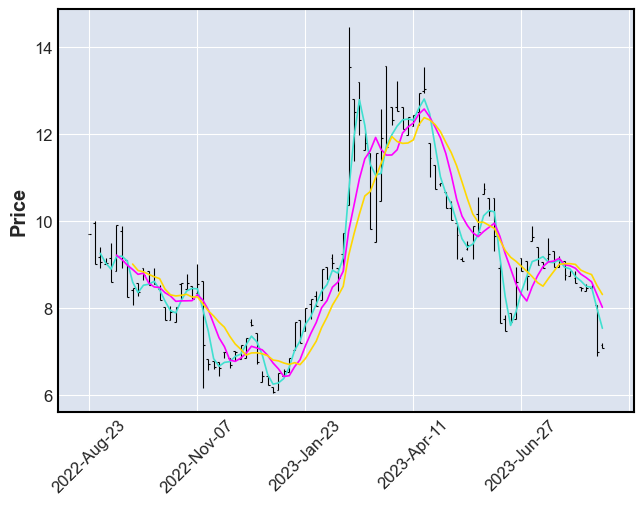
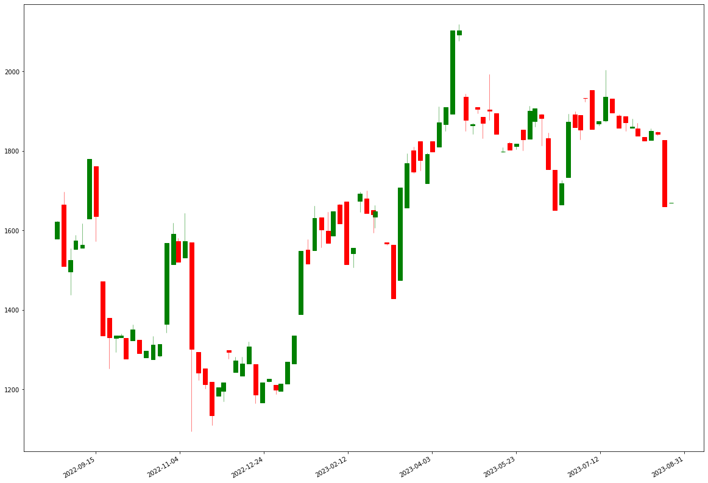

- - -

## Informacion General
### Estudiante: **Luis A, Ramirez G.** 
Usuario GitHub: `ramirezla` 
Email Github: `ramirezluisalberto@hotmail.com` 
Email usuario Henry: `ramirezgluisalberto@gmail.com` 

### Repositorio: PROYECTO INDIVIDUAL Nº2 
https: https://github.com/ramirezla/LARG_PI_DA-main.git 
ssh: git@github.com:ramirezla/LARG_PI_DA-main.git 
Branch: `main` 

*`NOTA` *
*Repositorio históricos: `Solo para consultas`: *
https: ~~https://github.com/ramirezla/LARG_PI_DA-main-final.git~~ 
ssh: ~~git@github.com:ramirezla/LARG_PI_DA-main-final.git~~ 
Branch: ~~`main-win`~~ 

### Versiones paquetes utilizados:  
OS: Linux x64 3.10.0-1160.92.1.el7.x8_64 `CentOS 7`  
OS: Windows 10  
Visual Studio Code 1.80.1 
PowerBI
jsonschema          3.2.0
matplotlib          3.3.4 
pandas              1.1.5 
PyGetWindow         0.0.9 
pip                 21.3.1 
Python              3.6.8 
requests            2.27.1 
- - -
<h1 align='center'>
 <b>PROYECTO INDIVIDUAL Nº2</b>
</h1>

# <h1 align="center">**`Cryptocurrency Market Data Analytics`**</h1>

- - -
### `El mercado de las criptomonedas ha experimentado un crecimiento exponencial en los últimos años, atrayendo la atención de inversores, traders y entusiastas de todo el mundo. A medida que este mercado evoluciona y se vuelve más complejo, surge la necesidad de comprender y analizar los datos relacionados con las criptomonedas.` 
- - -

### `Algunos criterios generales que deben ser utilizados al momento de selecconar criptomonedas`

- `Capitalización de mercado:` La capitalización de mercado es el valor total de todas las monedas en circulación. Se puede considerar aquellas criptomonedas con una capitalización de mercado alta, ya que generalmente son más estables y tienen mayor liquidez.

- `Equipo de desarrollo:` Investiga sobre el equipo detrás de cada criptomoneda. Revisa su experiencia, trayectoria y reputación en la industria. Un equipo sólido y con experiencia puede indicar un mayor potencial de éxito.

- `Tecnología y uso:` Examina la tecnología subyacente de cada criptomoneda y su caso de uso. Evalúa si la tecnología es innovadora, escalable y tiene un propósito real en el mundo real. Las criptomonedas con casos de uso prácticos y una tecnología sólida tienden a tener un mayor potencial de crecimiento.

- `Comunidad y adopción:` Observa el nivel de participación y apoyo de la comunidad en torno a cada criptomoneda. Una comunidad activa y comprometida puede ser un indicador de un mayor interés y adopción de la moneda.

- `Liquidez:` Considera la liquidez de cada criptomoneda. Una mayor liquidez facilita la compra y venta de la moneda, lo que puede ser importante si deseas operar con frecuencia.

- `Seguridad:` Investiga la seguridad de cada criptomoneda. Examina si han tenido problemas de seguridad en el pasado y si cuentan con medidas de seguridad sólidas, como el uso de criptografía y auditorías de seguridad.

- `Actualizaciones y desarrollo continuo:` Considera si la criptomoneda está recibiendo actualizaciones y mejoras constantes. Un desarrollo continuo indica un equipo activo y comprometido, lo que puede ser positivo para el futuro de la moneda.

- `Análisis técnico y fundamentos:` Puedes realizar un análisis técnico y fundamental de cada criptomoneda para evaluar su potencial de crecimiento. Esto implica analizar gráficos de precios, indicadores técnicos y noticias relacionadas con la moneda.

- `Diversificación:` Es recomendable diversificar tu cartera de criptomonedas para reducir el riesgo. Puedes seleccionar criptomonedas de diferentes categorías, como monedas principales, tokens de plataforma, tokens de finanzas descentralizadas (DeFi), etc.

- `Investigación personal:` Investiga y haz tu propia diligencia debida. Lee opiniones, noticias y análisis de expertos en criptomonedas, pero siempre toma tus propias decisiones informadas.

- `Análisis de la comunidad:` Observa la comunidad que rodea a cada criptomoneda. Puedes unirte a sus foros, grupos de Telegram, canales de Discord o redes sociales para obtener una idea de la participación y el sentimiento de la comunidad. Presta atención a las discusiones sobre actualizaciones, eventos futuros y adopción de la criptomoneda.

- `Análisis de la competencia:` Compara las criptomonedas dentro del top 10 y analiza cómo se posicionan en relación con su competencia. Observa cómo se diferencian en términos de tecnología, casos de uso, asociaciones estratégicas y adopción real. Esto te ayudará a evaluar su potencial a largo plazo y su capacidad para mantenerse competitivas en el mercado.

- `Análisis de la capitalización de mercado:` Observa la capitalización de mercado de cada criptomoneda y cómo ha evolucionado a lo largo del tiempo. Analiza las tendencias históricas y considera si hay factores que puedan afectar su valor en el futuro.

### `Selección de criptomonedas ha utilizar en el presente estudio, ésta selección se basó en sus similitud con respecto a su potencial y riesgo:`

- `Ethereum (ETH)`: Es una plataforma de código abierto que permite crear y ejecutar contratos inteligentes y aplicaciones descentralizadas. Su moneda nativa es el ether (ETH), que se usa para pagar las transacciones y los servicios en la red. Ethereum utiliza un mecanismo de consenso basado en la prueba de trabajo, pero planea migrar a la prueba de participación en un futuro próximo.

- `Cardano (ADA)`: Es una plataforma de contratos inteligentes que busca ofrecer seguridad, escalabilidad y sostenibilidad mediante el uso de un protocolo de prueba de participación llamado Ouroboros. Su moneda nativa es el ada (ADA), que se usa para transferir valor y participar en la gobernancia de la red. Cardano se basa en la investigación científica y el desarrollo formal, y se divide en varias capas: la capa de liquidación, que maneja las transacciones, y la capa de cómputo, que ejecuta los contratos inteligentes.

- `Polkadot (DOT)`: Es un protocolo de sharding multicadena que facilita la transferencia entre cadenas de cualquier tipo de datos o activos, no solo tokens, lo que hace que una amplia gama de blockchains puedan interoperar entre sí. Su moneda nativa es el dot (DOT), que se usa para gobernar la red, crear paracadenas y pagar las tarifas. Polkadot proporciona escalabilidad y seguridad mediante el uso de una cadena central llamada cadena de retransmisión, que se conecta con varias cadenas laterales llamadas paracadenas o parathreads.

- `Chainlink (LINK)`: Es una red descentralizada de oráculos que conecta los contratos inteligentes con datos del mundo real, como precios, eventos, clima, etc. Su moneda nativa es el link (LINK), que se usa para pagar a los proveedores de datos y los nodos operadores por sus servicios. Chainlink permite a los desarrolladores acceder a cualquier API y fuente de datos, integrarse con sistemas existentes y crear aplicaciones innovadoras en diversas industrias.

- `VeChain (VET)`: Es una plataforma orientada a las empresas que utiliza la tecnología blockchain para mejorar la eficiencia, la transparencia y la trazabilidad de las cadenas de suministro y otros procesos comerciales. Su moneda nativa es el vechain thor (VET), que se usa para transferir valor y ejecutar transacciones en la red. VeChain también genera otro token llamado vechain thor energy (VTHO), que se usa para pagar las tarifas del gas. VeChain tiene como objetivo impulsar la transformación digital en sectores como la salud, la energía, la alimentación y la sostenibilidad.

- `Cosmos (ATOM)`: Es un ecosistema de blockchains interoperables que permite crear, personalizar y conectar aplicaciones descentralizadas. Su moneda nativa es el átomo (ATOM), que se usa para delegar, votar y gobernar la red. Cosmos utiliza un protocolo de consenso basado en la prueba de participación llamado Tendermint, que ofrece alta velocidad y seguridad. Cosmos también ofrece un marco modular llamado Cosmos SDK, que facilita el desarrollo de blockchains específicas para cada caso de uso.

- `Tezos (XTZ)`: Es una plataforma de contratos inteligentes que se caracteriza por su capacidad de autoenmienda, lo que significa que puede actualizar su propio protocolo mediante un mecanismo de gobernancia en cadena. Su moneda nativa es el tez (XTZ), que se usa para transferir valor y participar en el proceso de consenso mediante el staking. Tezos utiliza un lenguaje formal llamado Michelson, que permite verificar matemáticamente la corrección y seguridad de los contratos inteligentes. Tezos busca ser una plataforma segura, escalable y sostenible para aplicaciones financieras e institucionales.

- `NEO (NEO)`: Es una plataforma de economía inteligente que combina activos digitales, identidades digitales y contratos inteligentes. Su moneda nativa es el neo (NEO), que representa el derecho a gestionar la red y no se puede dividir. Neo también genera otro token llamado gas (GAS), que se usa para pagar las tarifas del sistema y los servicios en la red. Neo utiliza un mecanismo de consenso llamado tolerancia a fallos bizantinos delegada (dBFT), que ofrece alta velocidad y finalidad. Neo tiene como objetivo crear una red abierta e innovadora para el desarrollo de aplicaciones descentralizadas.

- `IOTA (MIOTA)`: Es un ledger distribuido que no utiliza una blockchain, sino una estructura de datos llamada Tangle, que consiste en un sistema de nodos que confirman las transacciones. Su moneda nativa es el iota (IOTA), que se usa para transferir valor y pagar las tarifas en la red. Iota tiene como objetivo ofrecer alta velocidad, escalabilidad y seguridad sin tarifas ni mineros. Iota se enfoca en el Internet de las Cosas, permitiendo la comunicación y el intercambio de datos entre dispositivos conectados.

- `Zilliqa (ZIL)`: Es una plataforma de contratos inteligentes que busca ofrecer alta escalabilidad y rendimiento mediante el uso de un método de sharding llamado sharding de red, que divide la red en subredes paralelas que procesan las transacciones de forma independiente. Su moneda nativa es el zilliqa (ZIL), que se usa para transferir valor y pagar las tarifas en la red. Zilliqa utiliza un protocolo de consenso basado en la prueba de trabajo y la tolerancia a fallos práctica bizantina (pBFT), que ofrece seguridad y finalidad. Zilliqa también tiene su propio lenguaje de programación llamado Scilla, que facilita el desarrollo de contratos inteligentes seguros y verificables.

Simbolos: [`eth, ada, dot, link, vet, atom, xtz, neo, miota, zil`]

Id (nombres): [`ethereum, cardano, polkadot, chainlink, vechain, cosmos, tezos, neo, iota, zilliqa`]

### `Análisis basados en algunos enfoques`

- `Análisis técnico:` El análisis técnico se basa en patrones de precios pasados y datos del mercado para predecir movimientos futuros en el precio de una criptomoneda. Puedes aprender los conceptos básicos del análisis técnico y utilizar herramientas como gráficos y indicadores para evaluar el rendimiento de una criptomoneda.

- `Redes sociales y comunidades:` Participa en comunidades en línea y redes sociales dedicadas a las criptomonedas. Observa las discusiones y opiniones de la comunidad sobre las criptomonedas que estás evaluando. Sin embargo, ten en cuenta que estas opiniones pueden ser subjetivas y estar influenciadas por sesgos individuales.

- `Investigación de noticias y eventos:` Mantente actualizado sobre las noticias y eventos relacionados con las criptomonedas que estás evaluando. Las noticias pueden proporcionar información sobre asociaciones estratégicas, adopción, actualizaciones de desarrollo y cambios regulatorios que pueden afectar el valor de una criptomoneda.

### `Datos y calculos con los que se realizara un analisis tecnico de cada criptomoneda:`

- `El máximo histórico y el mínimo histórico:` Estos valores representan los niveles más altos y más bajos que ha alcanzado el precio de una criptomoneda desde su creación o desde un período de tiempo específico.

- `Volumen del mercado:` es la cantidad total de criptomonedas que se negocian en un mercado durante un período de tiempo determinado. Representa la cantidad de activos que se compran y venden en el mercado en un período de tiempo específico.

- `Capacidad del mercado:` Se refiere a la capacidad del mercado para absorber operaciones de compra y venta sin causar una fluctuación significativa en los precios. En otras palabras, es la medida de la capacidad del mercado para manejar grandes volúmenes de transacciones sin que esto tenga un impacto desproporcionado en los precios.

- `Datos de operaciones:` Se obtienen datos de operaciones de apertura, cierre, alta y baja de las operaciones de las criptomonedas que pueden proporcionar información sobre transacciones.

- `Volatilidad:` Es un calculo que se refiere a la magnitud de los cambios de precio o la variabilidad de los precios en un período de tiempo determinado. En pocas palabras, indica cuánto fluctúa el valor de una criptomoneda en el mercado.

- `Rendimiento:` Es un calculo que se refiere al cambio porcentual en el valor de la criptomoneda durante un periodo específico. Es una medida que indica cómo ha evolucionado el precio de la criptomoneda en un período de tiempo.

- `Media móvil:` Es un calculo utilizado en el análisis técnico para suavizar los datos de precios de una criptomoneda y ayudar a identificar tendencias a largo plazo.

- `Capitalización de mercado:` Es un calculo Se accede a la capitalización de mercado de una criptomoneda. La capitalización de mercado puede ser útil para comparar el tamaño relativo de diferentes criptomonedas y evaluar su posición en el mercado.

### Librerias en Python

from pycoingecko import CoinGeckoAPI 
import pandas as pd 

import matplotlib.pyplot as plt 
import seaborn as sns 

import json 
import requests 
import os 

- - - 

## ETL

Para los datos a analizar, se tomaron los siguientes:

`Valores OHLC De CoinGecko` 
Se recuperan los valores de apertura(Open), máximo(High), mínimo(Low) y cierre(Close) de una moneda para una cierta cantidad de días pasados ​​desde la fecha actual utilizando el método get_coin_ohlc_by_id(). 
Datos cada 4 dias desde el 21 Agosto 2022 al 21 Agosto 2023  
`Time, Open', High, Low, Close`

`Valores Market de CoinGecko` 
Se obtiene informacion de cada moneda sobre sus precios(Prices), capacidad del mercado(market_caps) y el total de volumen de las monedas(total_volumes). 
`Time, Prices, Market_Caps y Total_volumes`

### Los cambios principales para el ETL:
- Se crearon archivos .csv, tanto para monedas individuales como un archivo donde se agrupan todas las monedas.
- Se le adiciono a los datasets el campo Id, que contiene el Id de la moneda(nombre).
- En el campo timestamp, este campo representa el tiempo transcurrido en segundos desde el 01 de Enero de 1970 a la fecha, se transformo en un formato mas entendible y manejable: Mes, Dia y Año (MM-DD-AAAA)

- - - 

## EDA

- Se verifica outlier en los valores numéricos de los dataframes, para esto se muestra la informacion:

| Open | High |	Low |	Close |
| --------- | --------- | --------- | --------- |
| count	| 96.000000	| 96.000000	| 96.000000	| 96.000000	|
| mean	| 9.090417	| 9.343542	| 8.756354	| 9.017500	|
| std	| 1.776977	| 1.898822	| 1.674434	| 1.787611	|
| min	| 6.130000	| 6.200000	| 6.050000	| 6.090000	|
| 25%	| 7.865000	| 8.045000	| 7.677500	| 7.727500	|
| 50%	| 8.940000	| 9.035000	| 8.595000	| 8.720000	|
| 75%	| 9.960000	| 10.132500	| 9.535000	| 9.775000	|
| max	| 13.580000	| 14.460000	| 12.940000	| 13.560000	|

Cuando la std muestra es diferente de 0, indica que tiene valores diferentes, entonces pareciera que estan bien los datos.

- Se realizan gráficos de: boxplot (bigotes)

El Diagrama de Caja y bigotes (box and whisker plot en inglés) es un tipo de gráfico que muestra un resumen de una gran cantidad de datos en cinco medidas descriptivas, además de intuir su morfología y simetría. Este tipo de gráficos nos permiten visualizar y comparar la distribución y la tendencia central de valores numéricos mediante sus cuartiles.

- Se realizan gráficos de: scatter.

El diagrama de scatter, nos permite ver la dispersion de los datos.

- Se realizan gráficos de: Histograms.

- - -

### Realizando un Analisis visual mediante algunos graficos de velas

Un gráfico de velas es un tipo de gráfico financiero que muestra la acción del precio de un mercado de inversión como una moneda o un valor. El gráfico está compuesto por "candeleros" que muestran el precio de apertura, cierre, alto y bajo cada día para el mercado que representa en un período determinado.

    . Cuanto más lejos esté el precio de cierre de un gráfico de velas de cuerpo largo por encima del precio de apertura, más agresivos han sido los compradores de ese mercado. Si el precio de cierre se encuentra mucho más abajo que el precio de apertura, significa que los vendedores han sido más agresivos.

    . Si el gráfico de velas tiene una sombra superior e inferior larga con un cuerpo corto, se llama peonza. Este tipo de gráfico indica que el precio ha subido y bajado mucho durante la operación, pero que ni los compradores ni los vendedores han dominado la sesión de operación.

    . Si observas un gráfico de velas de peonza con sombras de longitudes iguales después de un período largo de inclinación y declinación para un mercado, puede a menudo representar una inversión en la tendencia.

    . Por ejemplo, si un gráfico de velas doji aparece después de un gráfico de velas largo en descenso, significa que la presión de venta disminuye y podría acercarse una tendencia alcista. Si aparece después de un gráfico de velas de tendencia alcista largo, significa que la presión de venta disminuye y el mercado podría comenzar a estar en alza.
    
    . Los gráficos de vela doji que tienen sombras inferiores largas y bajas indican que hay mucha indecisión en el mercado.

    . Ten en cuenta que estas formas son más significativas cuando se observan gráficos en un período más extenso. Por ejemplo, si notas un martillo en un gráfico de velas de un día, no es tan importante como si lo vieras en una tendencia alcista de una semana.

    . Para identificar posibles cambios en las tendencias a través de la observación de ciertas formas del gráfico de velas, siempre es mejor observar el gráfico por al menos una a cuatro semanas de actividad.

    . Para identificar posibles cambios en las tendencias a través de la observación de ciertas formas del gráfico de velas, siempre es mejor observar el gráfico por al menos una a cuatro semanas de actividad.

`Criptomoneda neo`

`Criptomoneda ethereum`

- - -

### Usando CoinGecko API V3

`Documentacion:` https://www.coingecko.com/es/api/documentation

`URL to make API request:` https://pro-api.coingecko.com/api/v3/

- /coins/{id}/market_chart - to get the historical price and market data of a coin.

https://api.coingecko.com/api/v3/coins/ethereum/market_chart?vs_currency=usd&days=1 
https://api.coingecko.com/api/v3/coins/cardano/market_chart?vs_currency=usd&days=1 
https://api.coingecko.com/api/v3/coins/polkadot/market_chart?vs_currency=usd&days=1 
https://api.coingecko.com/api/v3/coins/chainlink/market_chart?vs_currency=usd&days=1 
https://api.coingecko.com/api/v3/coins/vechain/market_chart?vs_currency=usd&days=1 
https://api.coingecko.com/api/v3/coins/cosmos/market_chart?vs_currency=usd&days=1 
https://api.coingecko.com/api/v3/coins/tezos/market_chart?vs_currency=usd&days=1 
https://api.coingecko.com/api/v3/coins/neo/market_chart?vs_currency=usd&days=1 
https://api.coingecko.com/api/v3/coins/iota/market_chart?vs_currency=usd&days=1 
https://api.coingecko.com/api/v3/coins/zilliqa/market_chart?vs_currency=usd&days=1 

another way to obtain coin prices & market data in bulk, by using ‘per_page’

https://api.coingecko.com/api/v3/coins/markets?vs_currency=usd&order=market_cap_desc&per_page=100&page=1

### Guia para usar la API CoinGecko desde Python

https://www.gocabanyal.es/tutorial-de-python-de-la-api-de-coingecko-analisis-de-alfa/

- - -

## `Se definiran los objetivos, los KPIs y el Analisis en PowerBI`